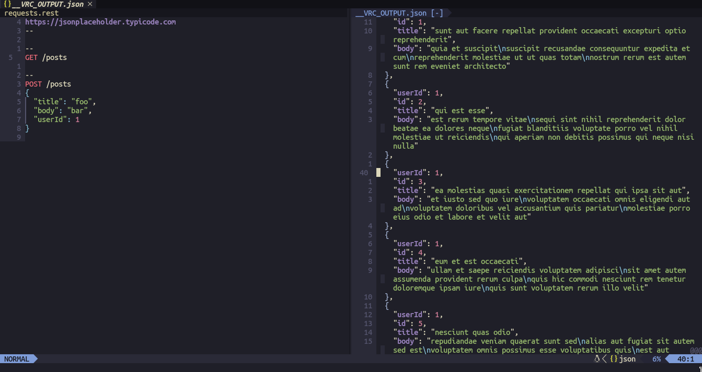

# Advanced Setup
## Features
With this configuration the editor will have the following features:

- Code auto-completion using LSP
- Code diagnostics
- Directory tree using NvimTree
- Git diff in the sign column
- API client using vim-rest-console
- Telescope
- Treesitter
- Icons
- And more...

## Quickstart

<details>
<summary>Unix, Linux</summary>

1. Install Nerd Fonts

2. Install Packer

```shell
git clone --depth 1 https://github.com/wbthomason/packer.nvim\
  ~/.local/share/nvim/site/pack/packer/start/packer.nvim
```

3. Install dependencies required by each plugin (Check the pages of each plugin)

4. Clone this repository

```shell
git clone https://github.com/CalleWilliam14/neovim-setup.git\
  ~/.config/nvim
```

5. Open neovim and install plugins with :PackerInstall

</details>

<br>

<details>
<summary>Windows</summary>

1. Install Nerd Fonts

2. Install Packer

>PowerShell

```shell
git clone https://github.com/wbthomason/packer.nvim "$env:LOCALAPPDATA\nvim-data\site\pack\packer\start\packer.nvim"
```

3. Install dependencies required by each plugin (Check the pages of each plugin)

4. Clone this repository

>PowerShell

```shell
git clone https://github.com/CalleWilliam14/neovim-setup.git "$env:LOCALAPPDATA\nvim"
```

5. Open neovim and install plugins with :PackerInstall
</details>

## Screenshots
> NvimTree with code diagnostics


<br>

> LSP auto-completion


<br>

> Vim rest console


